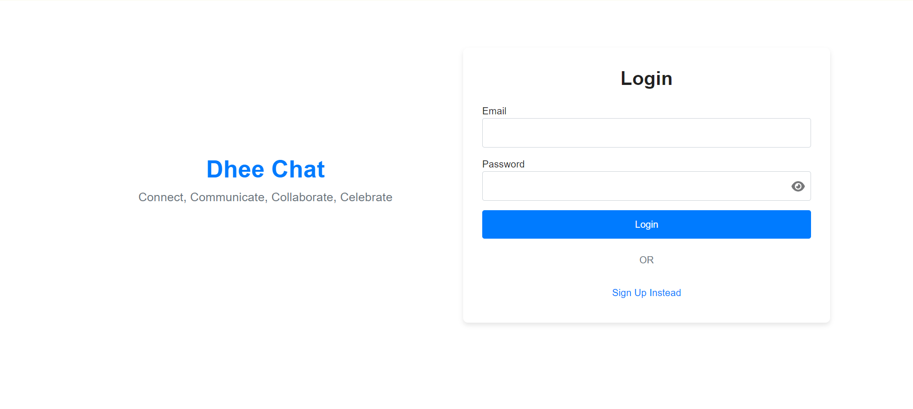
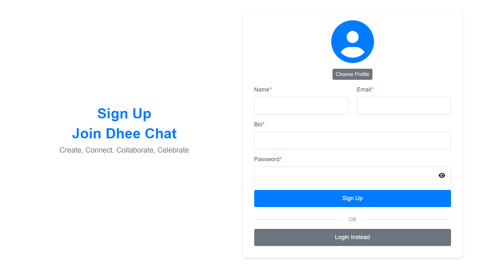
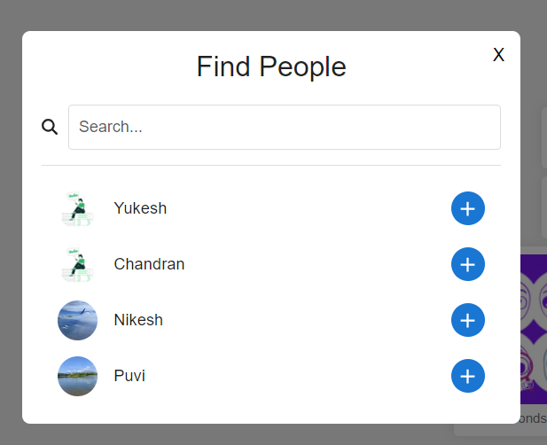
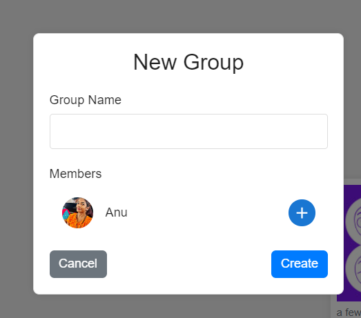
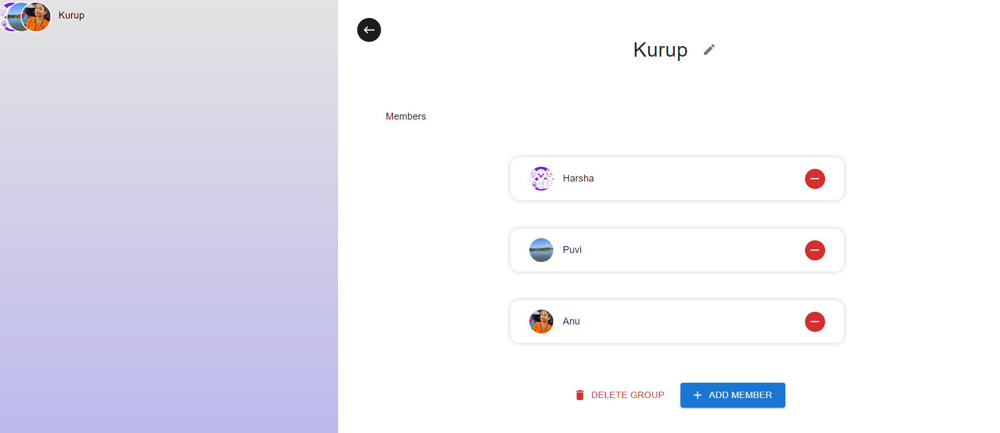
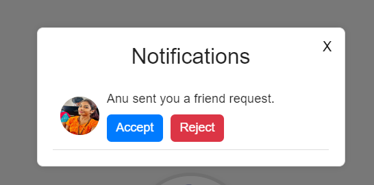
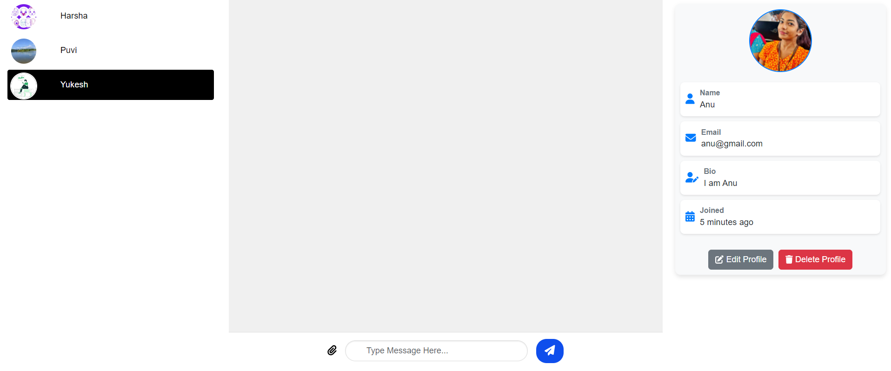
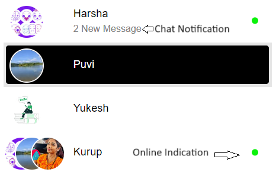
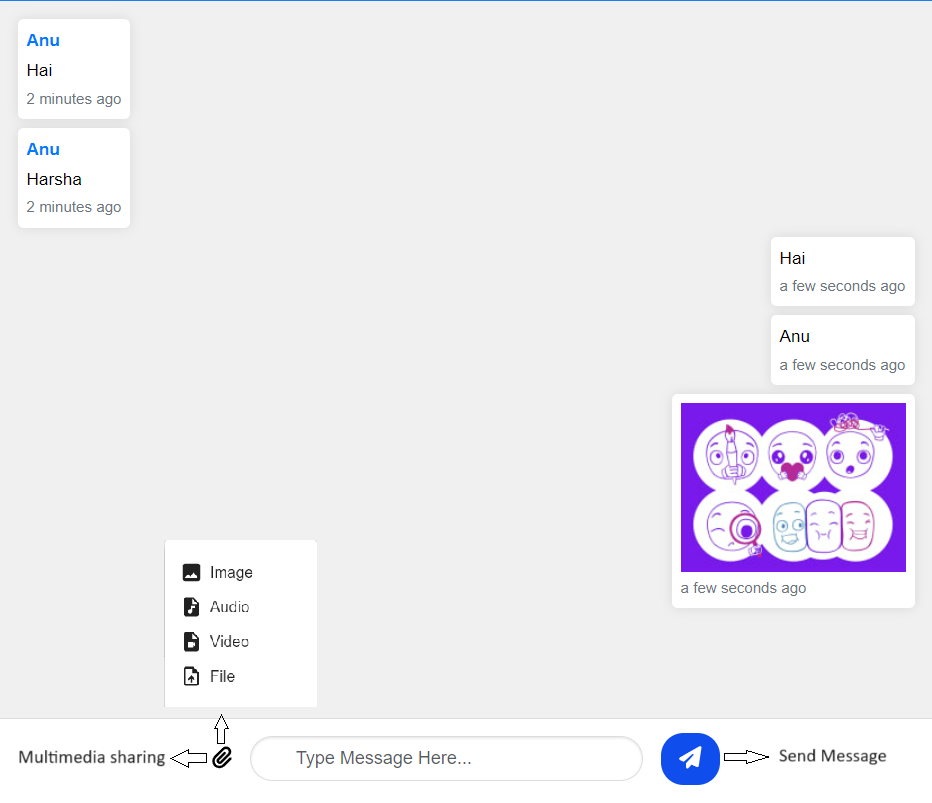
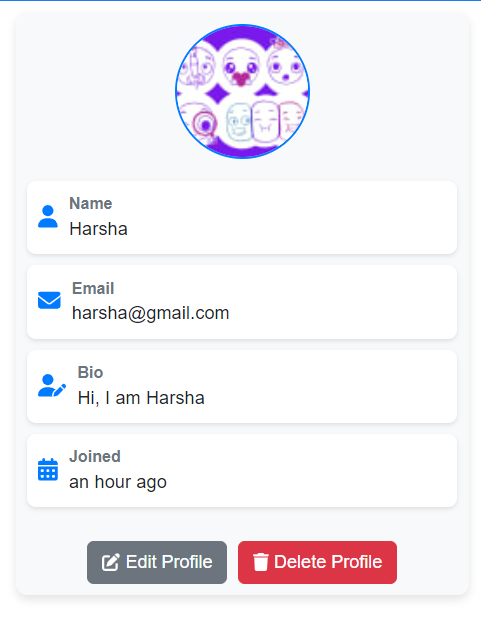

# Welcome to Dheechat!

This guide will help you get started with using Dheechat. Follow these instructions to navigate through our application.  

#### Disclaimer:
Since the application is in development stage you may face some issues at some point of time. Please **refresh the page**, It may resolve the issue.

## 1. Getting Started

### Logging In

When you first visit [Dheechat](https://dheechat.netlify.app/), you will land on the **Login Page**. 

**Login Page:**
- **Email:** Enter your email address.
- **Password:** Enter your password.
- **Sign In Button:** Click this to log in.

### Registering an Account

If you don’t have an account, you need to register first.

**Sign Up Page:**
- **Avatar:** Upload a profile picture.
- **Name:** Enter your full name.
- **Email:** Enter your email address.
- **Bio:** Write a short bio about yourself.
- **Password:** Create a password.

After registering, you will be navigated back to the **Login Page** to log in with your new credentials.

## 2. Home Page Features

### Header  

  

Once logged in, you’ll be taken to the **Home Page**. The header includes the following icons:

- **Search Icon:** Click to view users and send friend requests.  

- **Plus Icon:** Create a new group with friends. Add members and name the group. The creator is the group admin.  

  

- **Manage Group Icon:** Accessible only to the group admin. Use this to add members, rename, delete, or remove members from the group.  

   

- **Bell Icon:** Receive friend request notifications here.  
   

- **Logout Icon:** Click to log out of the application.  

  

### Layout  

The home page is divided into three main sections:

1. **Friends/Users List:**
   - Displays your friends or available users.

   

  
   - Delete Chat and leave group.

   

   
2. **Chat Area:**
   - Type and send messages.
   - Share multimedia files with friends.
   - Empty message warning

   

3. **Profile:**
   - **Edit Profile:** Update your profile information.
   - **Delete Account:** Delete your account if needed.

   

## 3. Tips and Tricks

- **Searching Users:** Use the search function in the header to find friends quickly.
- **Creating Groups:** Utilize the plus icon to organize group chats efficiently.
- **Managing Groups:** Keep your groups organized using the manage group options.

## 4. Fixing Bugs and Support

- For any issues or questions, please email me at [yukeshchandran002@gmail.com](mailto:yukeshchandran002@gmail.com).

## 5. Contact Us

- For further assistance, contact me at [yukeshchandran002@gmail.com](mailto:yukeshchandran002@gmail.com).
- Connect with me on [LinkedIn](https://www.linkedin.com/in/yukesh-chandran/).

